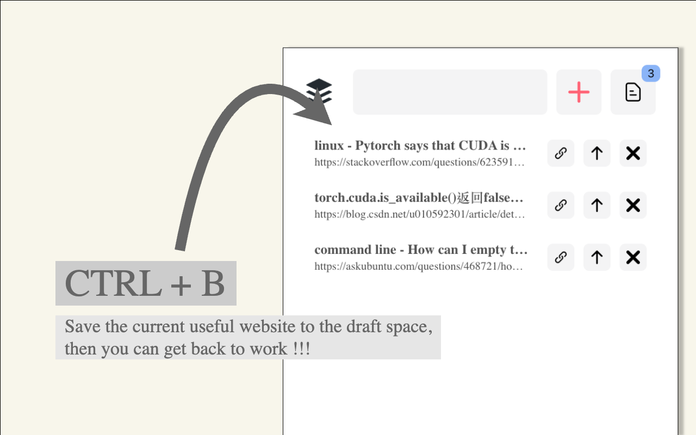
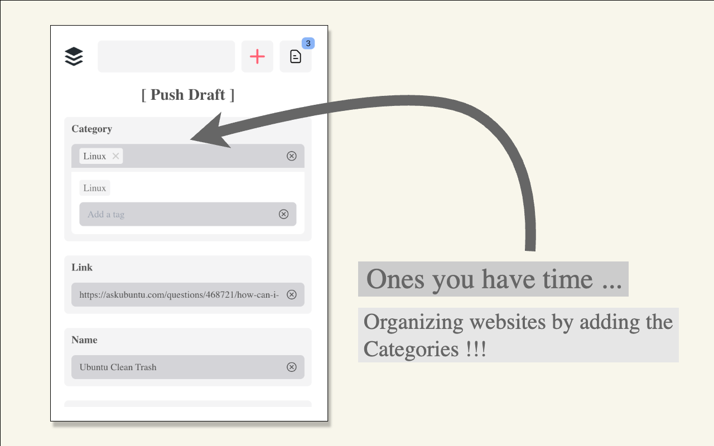
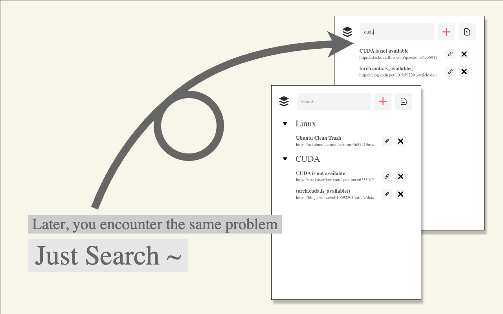

<div style="padding: 20px 0" align="center">
    
    <h1 style="padding: 20px"> [ Buggy ] - Save, Organize, and Search Websites !!! </h1>
</div>

**[ Buggy ]** is a Chrome extension built for developers who frequently end up searching for the same coding solutions. Inspired by common development workflows like commit and push, Buggy provides an intuitive way to save solutions (such as those from Stack Overflow), allowing developers to easily **Save**, **Organize**, and **Search** these resources for future use without interrupting the developing process.

<div style="display: flex; justify-content: space-between;">
    
    
    
</div>

## How To Use 📌
### Save the Website 💾
When you find the perfect solution, simply press **CTRL + B** (**CMD + B** for Mac users) to commit the website as a draft in the draft space. This lets you stay focused on your current development without interrupting your workflow.

### Organize It 📁
Once you’ve spare time, you can organize your drafts. If you want to save them permanently, simply push them to the repo. By assigning a category, you can neatly organize these websites.

### Search It 🔍
The next time you encounter the same problem, you can quickly access the solution by searching through categories or using the search function to find the saved website.

## Local Build Guide 📌
```
npm install
npm run build
```

Load the `/build` folder to the extension page.

## Solving Bugs 📌
This is a new project, [join us](https://github.com/Xiayucheng1212/buggy_extension/issues) to build it more perfectly!!

## Contributers 📌
Thanks to [Winston Wang](https://github.com/dinoslow) and [Yu-Cheng Xia](https://github.com/Xiayucheng1212) ❤️
